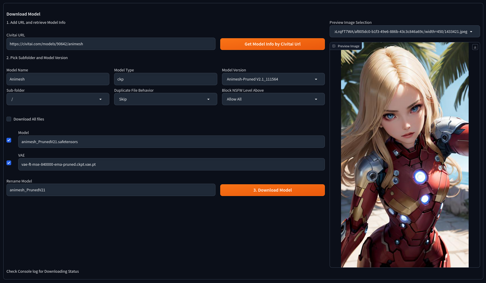
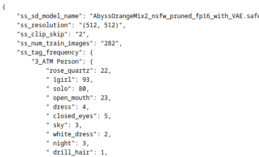

# Change Log
## v1.8.13
* Fix compatibility with non-Forge instances

## v1.8.12
* New feature: Add Civitai-style metadata to images
  * Thanks ComplexRobot!
* GGUF scanning support
* Downloader now supports creating new subdirectories when downloading models
* Updated base models list in Browser
* Additional UI for batch downloading
  * Thanks webik150!
* Fixed several issues:
  * Vae Downloading now works
  * Duplicate models results UI now properly scrolls
  * Browser now works with blank searches
  * Incorrect Lycoris directory
    * Thanks gayspacegems!

## v1.8.11
* Gradio 4.0 compatibility.
* Fix an issue where extension would crash if no images could be loaded for a model in browser.
* Support AutoV3 Hashes for scanning.
* No longer remove HTML from model descriptions by default, since WebUI no longer displays HTML by default.
* Browser can now be disabled.
* New option to automatically sort Loras into subdirectories by Civitai category when scanning.

## v1.8.10
* Removed broken "Update image generation information (Experimental)" feature.
* Add additional checks for NSFW images in features that previously were missing them.

## v1.8.9
* Fixed an issue where the batch downloader would fail to download preview images.

## v1.8.8
* DORA support in the Civitai Helper Browser
* Fixed an issue where lack of previews would break searching for models
* All NSFW options have been moved into Settings.

## v1.8.7
* DoRA models can now be downloaded via the Downloader.
* Fixed a bug that caused the Model Age filter to fail in the CH Browser.

## v1.8.6
* Added a Civitai Browser & Search.
  * Currently downloading a model hooks into the existing Downloader UI. I'd like to change this eventually but every additional UI element added through Gradio introduces performance degredation. (Currently the browser results themselves are written in raw HTML, CSS, and Javascript similar to webui's built in extra network viewer instead of relying on Gradio)
  * Please report issues: I've only tested on Firefox and Forge.
* Small changes to Downloader UI:
  * Now shows base model of models, so models trained/based on SD1.5, SDXL, Pony, etc can be determined from the UI
  * Batch Downloader now supports the `Subfolder` option.

## v1.8.5
* Batch downloading now lists the files that were actually downloaded.
*
* Download progress is now listed as Giga/Mega/Kilo-bytes instead of just bytes. Previously only download speed was listed as such.
* The "Download All Examples" setting should no longer cause models without Civitai pages to cause scanning to fail.
* Unexpected metadata in safetensors files when scraping metadata from a model should no longer cause model scanning to fail.
* Fixed a bug where models not on civitai would attempt to search for previews on civitai, causing scanning to fail.
* Model updating should no longer fail on models that require an API key when an API key is present.
* Undocumented change from v1.8.3: If the same version of a model already exists, the location of the model will now be shown with the duplicate model message.

## v1.8.4
* Fixes to model scanning and model update checking.

## v1.8.3
* Batch Downloader
* Multiple model preview images can now be downloaded locally. See new option in Settings. Feature by mx.
* Improved download retry logic from Godsfoot
* Dropping compatibility for webui versions less than 1.6.0
  * The branch v1.5-compatible has been added for users of versions before 1.6.0, but it will no longer be updated.
  * The v1.6ONLY branch has been merged into the main project, which includes JS optimizations and some JS sandboxing intended to reduce the potential for extension conflicts.

## Interim updates between 1.8.2 and 1.8.3
* Support for WebUI Forge
* Support for WebUI 1.8.0

## v1.8.2
* Model scanning and duplicate scanning now have progress bars.
* Replaced the preview file selection dropdown when downloading a model with a gallery.
  * This feature is intended to be extended if webui's internal Gradio version is updated to one that allows changing the currently selected gallery image from Python, as currently it's "sticky" and will keep the same preview index when you switch to a different model URL. IE: if you are downloading a model and pick Preview Image #3, the next model you download will have its third preview image selected by default. You can still change it by selecting a different image yourself, but the extension currently cannot do it automatically.

## v1.8.1
* Editing proxies should no longer require a UI restart.
* Fixed a bug where the model downloader wouldn't download Max Size Previews even if the option was enabled in settings.

## v1.8.0
** HOTFIX: Fixed a small bug where a non-standard NSFW value for preview images from Civitai's API could error out model scanning.
* New Feature: Scan for Duplicate Models
  * Models that have no metadata files (from civitai or generated by the normal model scanner) will not be checked.
* Fixed a bug where models with `'` in their name would cause buttons to be no-op.
* Changed layout of Civitai Helper tab to be more compact
* Model Downloader has received signifiant updates that add the following features:
  * Preview Image selection
  * Per-file Download selection
  * Model Renaming now works with Download All Files
  * Models that include a recommended VAEs will now have their VAE placed in the appropriate VAE directory.
    * Preferred VAE will also be added to the model metadata so that it will be used if your VAE settings are set to `Automatic`.

## 1.7.9
* Downloader fixes from [Milly](https://github.com/Milly).

## 1.7.8
* Model Downloader now supports changing the filename before downloading.
* If a download cannot be resumed, it will now be restarted.

## 1.7.7
* Implemented authentication via API Key.
  * This allows the user to download models that require authentication.

## 1.7.6
* Downloader rewrite:
  * Downloading models will now show download progress in webui.
  * Download errors will now be displayed in webui, with more detailed information still in console output.
* The current model filename will now be included when renaming models.
* Extension should now at least run in [Vladmandic's stable diffusion webui](https://github.com/vladmandic/automatic) thanks to [#32](https://github.com/zixaphir/Stable-Diffusion-Webui-Civitai-Helper/pull/32).
  * I do not run Vladmandic and have not personally tested functionality. Users who would like to address issues with Vladmandic compatibility may send a [Pull Request](https://github.com/zixaphir/Stable-Diffusion-Webui-Civitai-Helper/pulls).

## 1.7.5
* Missing image generation info in civitai.info files can now be retrieved from civitai by downloading the image and parsing its EXIF data. Most people should not need this, but it can be helpful if you're trying to recreate an image or more like it from the model's preview page. This will only work if the model author left metadata in the image.
* Added some compatibility code for the Lobe theme extension
* Reduce timeout errors, retry failed downloads.
* Added an option to use sd webui's SHA256 hashing function instead of our own.

## 1.7.4
* Added "Remove Model" button. From butaixianran's repo.
* Added "Rename Model" button.
* New `.json` files will now have their descriptions surrounded by HTML comments as to not break model cards when card descriptions are enabled. If you want to display these descriptions on cards, you can remove the leading `<!--` and tailing `-->`, but you will be responsible for any issues that arise.
* Card buttons can now be hidden individually. By default, the "insert trigger words" button is hidden on newer versions of sdwebui, where this functionality happens automatically if the metadata `JSON` exists, which is created when models are scanned with default settings.
* Model names on cards now have a maximum height when not hovered, which should prevent the model name from occupying the whole card.
* Fix downloading size check issue. From butaixianran's repo.
* NSFW previews can now be blocked by severity, from Soft, Mature, X, and Allow All. From sdy623's repo. These don't seem to be documented on Civitai's end, but here's what I've been able to gather by pinging the API and seeing what images were returned.
  * Soft images do not appear to contain explicit nudity, but may have implicitly suggestive elements or clothing that outline the underlying body closely enough that details underneath poke out or have their silhoutte visible.
  * Mature images may contain nudity, but could just as easily show a little too much cleavage or are otherwise actively sexually suggestive.
  * X are explicitly pornographic.

## v1.7.3
* Downloading webui model information (`[model_name].json`) is now optional and can be configured in the webui settings.
* When a model is not found on Civitai, this extension will attempt to read the model header for activation keywords. This only works with safetensors files with kohya_ss metadata and may be inaccurate depending on how the model was trained. This method assumes the model was trained with each trained concept having its own training folder. This is not always the case.
  * This information can also be found in webui without any extensions by clicking the :information_source: button and reading the `"ss_tag_frequency":` section. This section may prove more helpful on models that are trained on multiple concepts but with all the training data under one directory. For instance, if it was trained for certain characters, search the list for that character's name. Often model authors will use a name plus a unique identifier as to not cause the character to "bleed into" other characters with the same name. For instance, we can the [All The Mothers](https://civitai.com/models/48200) lora has all of its trained characters as tagged images under one dataset:

## v1.7.2
* Better HTML sanitization/removal from Descrition/Note fields.
* CivitAI Anti-DDOS false-positive delay lowered. This may be reverted if it causes issues, tho <5 API hits a second shouldn't be too bad.
* CivitAI Anti-DDOS false-positive delay added to all models, not just embeddings, when performing model scans.
  * However, delay has been removed when a scanned model does not need to perform an API hit to CivitAI.
* Enabled functionality to re-download model data if the current data is from an older version of SD-Webui-Civitai-Helper.
  * For many people, this will not be necessary. For those migrating from the original extension, missing data for WebUI is handled separately and will be downloaded on scan anyways.
  * For more details, see the [wiki](https://github.com/zixaphir/Stable-Diffusion-Webui-Civitai-Helper/wiki/Metadata-Format-Changes).
* **HOTFIX**: if a model has been deleted from Civitai, the `Replace Old Metadata Formats` option will no longer overwrite working data with dummy data.

## v1.7.1
* Settings are now in the settings menu.
* Model previews following the name format `[model name].preview.[format]` in JPEG, GIF, and WEBP formats are now checked before downloading model previews from civitai.
* HTML in the model description and version information should be removed and replaced more eloquently.
* Improved layout of Model Update interface.
* Added options for behaviors when downloading a model with the same filename as one already existing.
  * The new default is to skip downloading, replacing the old default of renaming the new model.
* **Post-release Hotfix**: fixed skeleton JSON generation for models not found on CivitAI.

## v1.7.0
* Added compatibility with Stable Diffusion WebUI v1.5.0-v1.6.0.
* Downloading metadata from Civitai should now include more exhaustive data, including correct description and tags.
* NSFW preview detection should be accurate.
* Native and Extension LyCoris support should function.
* Buttons added by this extension no longer require a separate button to add to UI.
* Extension populates Stable Diffusion WebUI's new metadata editor with description, Checkpoint model version, version information, and activation prompt(s).
  * This should allow simply clicking a card to add model activation prompts.
* Model Download UI requires fewer clicks to download a model.

## v1.6.4
* Add "Download All files" checkbox for downloading model section. Uncheck means only download 1 file.

## v1.6.3
* Support downloading multiple files, not avaiable when checking new version.

## v1.6.2.1
* when parsing civitai url, remove query string by PR

## v1.6.2
* When downloading, re-name file if file already exists

## v1.6.1.1
* Support bilingual localization extension by PR

## v1.6.1
* Fix Localization issue for 4 addtional buttons on cards. (Forgot that again...)

## v1.6.0
* Fix some UI issues to work with gradio 3.23.0
* Support Proxy when connecting to civitai. Check document for detail.
* check realpath when opening file, to fix error when using junction
* Fix multiple addtional buttons issue after switching tabs.

## v1.5.7
* Fix Localization issue for 4 addtional buttons on cards

## v1.5.6
* update error msg when can not connect to civitai API service
* update thumb mode for SD webui new version's metadata button

## v1.5.5
* update SHA256 function, now it just use the code from pip

## v1.5.4
* set sys.stdout to utf-8
* Add default header for requests to prevent from being blocked by civitai.
* merge other v1.5.x change log to v1.5.4
* When downloading a model by url, check if target model version is already existed in user selected sub-folder.
* Support scanning only selected model types.
* Force TI scanning delay 1 second to prevent from civitai treating this extension's requests as attacking.

## v1.5.0
* Download a model by Civitai model page's url
* Resume downloading from break-point
* Download new version into SD Webui's model folder
* Addtional button now works on thumbnail mode
* Option to always show addtion button, for touch screen.

## v1.4.2
* ignore .vae file in model folder when scanning

## v1.4.1
* When checking new versions, also searching and ignore already existed ones.
* Add version number to the bottom of this extension's tab

## v1.4
* Support checking model's new version, display the result in UI and offer download url
* Remove addintional sub tabs on extension tab. make ui simpler.

## v1.3
* Open url at client side
* Link selected model to civitai by url or model id
* Save and load extension setting to file
* Show button action's output to UI
* Code refactoring

## v1.2.1
* Add more error checking to work with different versions of SD webui.

## v1.2
* Support customer model folder
* Support readable model info file
* Support download preview image with max size
* Remove card buttons when extra network is in thumbnail mode

## v1.1
* Support subfolders
* Check if refresh is needed when clicking "Refresh Civitai Helper"
* Add space when adding trigger words
* Add memory Optimized sha256 as an option
