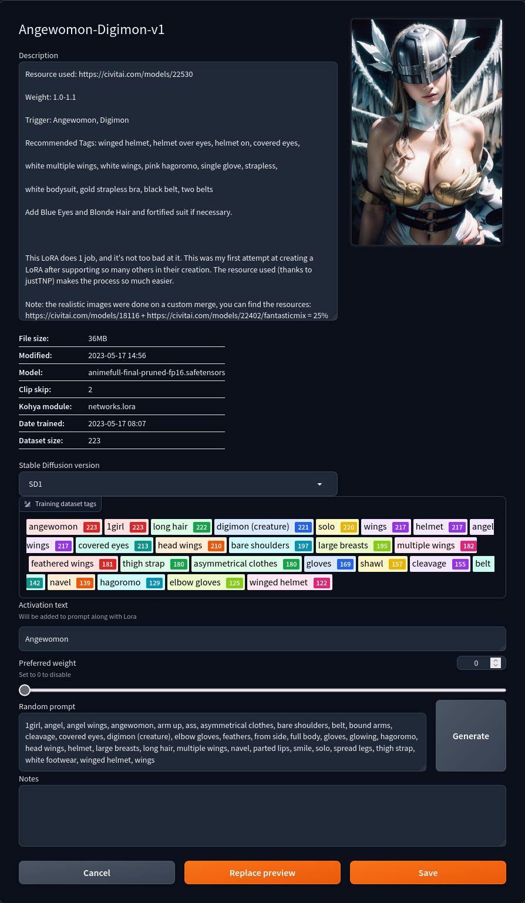
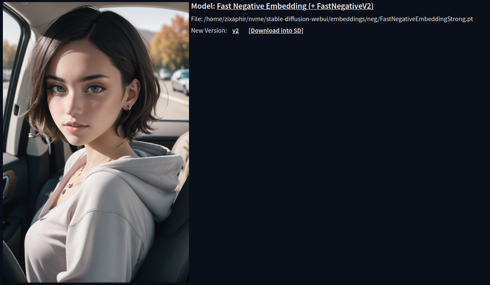

**[Contributors](https://github.com/zixaphir/Stable-Diffusion-Webui-Civitai-Helper/graphs/contributors)**

### Language
[中文(ChatGPT)](README.cn.md)
[日本語(ChatGPT)](README.jp.md)
[한국어(ChatGPT)](README.kr.md)

## About Civitai Helper
This extension provides the ability to download models and model metadata from Civitai. Data such as activation keywords, model description, version information, and model previews for models hosted on Civitai can be at your fingertips without having to navigate away from stable diffusion webui.

## About This Version of Civitai Helper
This is my personal version of Stable-Diffusion-Webui-Civitai-Helper. I started it entirely because the version I was using broke when SD-webui v1.5 came out and I needed it to work. Since then, I have added functionality that I wanted and have made best-effort attempts to maintain compatibility with older versions of sd-webui, but I do not use older versions and therefore do not test on older versions.

I intend to keep this working for as long as I am able, but this is simply a hobby project and I am nowhere near as skilled as other extension developers with more experience. I am likely to dip out for long periods at a time, possibly forever if I lose interest. I am prone to errors and bugs are to be expected.

If a more interested part decides to pick up development, I will happily cede control of this project and attempt to push my changes to their projects if they are wanted.

# Civitai Helper
Stable Diffusion Webui Extension for Civitai, to handle your models much more easily.

Civitai: 

# Features
* Scans all models to download model information and preview images from Civitai.
* Link local model to a civitai model by civitai model's url
* Download a model(with info+preview) by Civitai Url into SD's model folder or subfolder.
* Downloading can resume at break-point, which is good for large file.
* Checking all your local model's new version from Civitai
* Download a new version directly into SD model folder (with info+preview)
* Modified Built-in "Extra Network" cards, to add the following buttons on each card:
  - 🖼️: Modified "replace preview" text into this icon
  - 🌐: Open this model's Civitai url in a new tab
  - 💡: Add this model's trigger words to prompt
  - 🏷️: Use this model's preview image's prompt
* Above buttons support thumbnail mode of Extra Network
* Option to always show additional buttons, to work with touchscreen.

# Install
Go to SD webui's extension tab, go to `Install from url` sub-tab.
Copy this project's url into it, click install.

Alternatively, download this project as a zip file, and unzip it to `Your SD webui folder/extensions`.

Everytime you install or update this extension, you need to shutdown SD Webui and Relaunch it. Just "Reload UI" won't work for this extension.

Done.

# How to Use

## Update Your SD Webui
This extension need to get extra network's cards id. Which is added since **2023-02-06**.
**If your SD webui is an earlier version, you need to update it!**

### Some of the following information may not up-to-date. Most functionality should be the same or similar, but many changes post-v1.6 have not been documented as of yet. Images may not match 1:1 with the current state of the extension.

## Scanning Models
Go to extension tab "Civitai Helper". There is a button called "Scan model".

Click it and the extension will scan all your models to generate SHA256 hashes, using them to retreive model information and preview images from Civitai.

**Scanning takes time, just wait it finish**

For each model, it will create two files to save all model info from Civitai. These model info files will be `[model_name].civitai.info` and `[model_name].json` in your model folder.

If a model info file already exists, by default it will be skipped. If a model cannot be found in Civitai, a minimal model info file will be created with any information that can be extracted from the model. By default, a model with model pre-existing model info files will not be scanned.

### Adding New Models
When you have some new models, just click scan button again to get new model's information and preview images. Only new models will be scanned with default options.

## Model Card
**(Use this only after scanning finished)**
Open SD webui's build-in "Extra Network" tab, to show model cards.

Move your mouse on to the bottom of a model card. It will show 4 icon buttons:
  - 🖼: Replace preview (a build-in button, modified from text to icon)
  - 🌐: Open this model's Civitai url in a new tab
  - 💡: Add this model's trigger words to prompt
  - 🏷: Use this model's preview image's prompt

## Webui Metadata Editor
As of v1.7.0, this extension also downloads data for Webui's Metadata Editor by default. This data includes information you'd previously have to read unruly JSON files or navigate to Civitai to read.

This data can be accessed by clicking the metadata button on the model card.

## Download
To download a model by Civitai Model Page's Url, you need 3 steps:
* Fill the Civitai URL or Model ID
* Click "1. Get Model Information by Civitai Url.
* It will fill model name, type, sub-folder, and model version automatically, but you can change the sub-folder and model version if you need to.
  * If you need to add more sub-folders, you must do this by navigating to the model directory on the system running your webui version.
* Click download.

Detail will be displayed on console log, with a progress bar.
Downloading can resume from break-point, so no fear for large file.

## Checking Model's New Version
You can checking your local model's new version from civitai by model types. You can select multiple model types.

The checking process has a small delay after each model's new version checking request. So it is a little slow.

This is to protect Civitai from issue like DDos from this extension. There is no good for us if it is down.

**After checking process done**, it will display all new version's information on UI.

There are 3 urls for each new version.
* First one is model's civitai page.
* Second one is new version's download url.
* Third one is a button to download it into your SD's model folder with python.
With this one, output information is on "Download Model" section's log and console log. **One task at a time**.

## Get Model Info By Url
This is used to force a local model links to a Civitai model. For example, you converted a model's format or pruned it. Then it can not be found on civitai when scanning.

In that case, if you still want to link it to a civitai model. You can use this funcion.

Choose this model from list, then offer a civitai model page's url.

After clicking button, extension will download that civitai model's info and preview image for the local file you picked.

## Proxy
**If you are updating to new version, you need to re-lanuch SD webui before using it.**

Proxy textbox is at the bottom of extension tab.

**Each time you fill or clear a proxy value, you need to save setting, and Re-load UI with setting tab's reload button.**

Then all requests to civitai will use the proxy.

For some sock5 proxy, need to be used as "socks5h://xxxxx".

## Other Setting
**The Save Setting button, will save both "Scan Model"'s setting and other setting.**

* "Always Display Button" is good for touch screen.
* "Show Buttons on Thumb Mode" will turn on/off additional Buttons on thumbnail.

## Preview Image
Extra network uses both `model_file.png` and `model_file.preview.png` as preview image. But `model_file.png` has higher priority, because it is created by yourself.

When you don't have the higher priority one, it will use the other automatically.

## Prompt
When you click the button "Use prompt from preview image", it does not use the prompt from your own preview image. It uses the one from civitai's preview image.

On civitai, a model's preview images may not has prompt. This extension will check this model's all civitai preview images' information and use the first one has prompt in it.

## SHA256
To create a file SHA256, it need to read the whole file to generate a hash code. It gonna be slow for large files.

Also, extension uses Memory Optimized SHA256, which won't stuck your system and works with colab.

There are 2 cases this hash code can not find the model on civitai:
* Some old models, which do not have SHA256 code on civitai.
* The model's owner changed file on civitai, but does not change version name and description. So, the file on civitai is actually not the one on your manchine.

In these cases, you can always link a model to civitai by filling its URL in this extension.

## Feature Request
Feel free to submit feature requests, but pull requests are preferred.

Enjoy!

## Pull Requests
All pull requests should target the dev branch. For those who take a stab at the code, I apologize for the lack of consistency in coding style, naming, and other syntactical oddities. At some point, I intend to clean up the code and have everything pass linting, but we're not there yet.

## Common Issue
### 4 Buttons on card didn't show
#### Localization
There was a Localization issue if you are not using English version of SD webui. This is fixed in the latest version of this extension. **Bilingual localization extension is supported by PR since v1.6.1.1.**

##### Using cloud based localization extension
Turn off cloud based localization extension, use normal localization extension.

#### Other case
First of all, make sure you clicked "Refresh Civitai Helper" button.

If issue is still there, then only reason is you are not using the latest SD webui. So, Make sure you updated it.

Your update could be failed if you have modified SD webui's file. You need to check git command's console log to make sure it is updated.

In many cases, git will just refuse to update and tell you there are some conflicts need you to handle manually. If you don't check the consloe log, you will think your SD webui is updated, but it is not.

### Request, Scan or Get model info failed
Usually the reason for this most likely is the connection to Civitai API service failed. This can be for a number of reasons.

Sometimes Civitai can be down or refuse your API connection. Civitai has a connection pool setting. Basicly, it's a max connection number that civitai can have at the same time. So if there are already too manny connections on civitai, it will refuse your API connection.

In those cases, the only thing you can do is just wait a while then try again. I suggest making a cup of tea!

### Get Wrong model info and preview images from civitai
A bad news is, some models are saved with a wrong sha256 in civitai's database. Check here for more detail:
[https://github.com/civitai/civitai/issues/426](https://github.com/civitai/civitai/issues/426)

So, for those models, this extension can not get the right model info or preview images.

In this case, you have to remove the model info file and get the right model info by a civitai url on this extension's tab page.

Also, you can report those models with wrong sha256 to civitai at following page:
[https://discord.com/channels/1037799583784370196/1096271712959615100/1096271712959615100](https://discord.com/channels/1037799583784370196/1096271712959615100/1096271712959615100)

Please report that model to civitai, so they can fix it.

### Scanning fail when using colab
First of, search your error message with google. Most likely, it will be a colab issue.

If you are sure it is a out of memory issue when scanning models, and you are using this extension's latest version, then there is nothing we can do.

Since v1.5.5, we've already optimized the SHA256 function to the top. So the only 2 choices for you are:
* try again
* or use a pro account of colab.

# Change Log
## v1.7.3
* Downloading webui model information (`[model_name].json`) is now optional and can be configured in the webui settings.
* When a model is not found on Civitai, this extension will attempt to read the model header for activation keywords. This only works with safetensors files with kohya_ss metadata and may be inaccurate depending on how the model was trained. This method assumes the model was trained with each trained concept having its own training folder. This is not always the case.
  * This information can also be found in webui without any extensions by clicking the :information_source: button and reading the `"ss_tag_frequency":` section. This section may prove more helpful on models that are trained on multiple concepts but with all the training data under one directory. For instance, if it was trained for certain characters, search the list for that character's name. Often model authors will use a name plus a unique identifier as to not cause the character to "bleed into" other characters with the same name. For instance, we can the [All The Mothers](https://civitai.com/models/48200) lora has all of its trained characters as tagged images under one dataset:
  

## v1.7.2
* Better HTML sanitization/removal from Descrition/Note fields.
* CivitAI Anti-DDOS false-positive delay lowered. This may be reverted if it causes issues, tho <5 API hits a second shouldn't be too bad.
* CivitAI Anti-DDOS false-positive delay added to all models, not just embeddings, when performing model scans.
  * However, delay has been removed when a scanned model does not need to perform an API hit to CivitAI.
* Enabled functionality to re-download model data if the current data is from an older version of SD-Webui-Civitai-Helper.
  * For many people, this will not be necessary. For those migrating from the original extension, missing data for WebUI is handled separately and will be downloaded on scan anyways.
  * For more details, see the [wiki](https://github.com/zixaphir/Stable-Diffusion-Webui-Civitai-Helper/wiki/Metadata-Format-Changes).
* **HOTFIX**: if a model has been deleted from Civitai, the `Replace Old Metadata Formats` option will no longer overwrite working data with dummy data.

## v1.7.1
* Settings are now in the settings menu.
* Model previews following the name format `[model name].preview.[format]` in JPEG, GIF, and WEBP formats are now checked before downloading model previews from civitai.
* HTML in the model description and version information should be removed and replaced more eloquently.
* Improved layout of Model Update interface.
* Added options for behaviors when downloading a model with the same filename as one already existing.
  * The new default is to skip downloading, replacing the old default of renaming the new model.
* **Post-release Hotfix**: fixed skeleton JSON generation for models not found on CivitAI.

## v1.7.0
* Added compatibility with Stable Diffusion WebUI v1.5.0-v1.6.0.
* Downloading metadata from Civitai should now include more exhaustive data, including correct description and tags.
* NSFW preview detection should be accurate.
* Native and Extension LyCoris support should function.
* Buttons added by this extension no longer require a separate button to add to UI.
* Extension populates Stable Diffusion WebUI's new metadata editor with description, Checkpoint model version, version information, and activation prompt(s).
  * This should allow simply clicking a card to add model activation prompts.
* Model Download UI requires fewer clicks to download a model.

## v1.6.4
* Add "Download All files" checkbox for downloading model section. Uncheck means only download 1 file.

## v1.6.3
* Support downloading multiple files, not avaiable when checking new version.

## v1.6.2.1
* when parsing civitai url, remove query string by PR

## v1.6.2
* When downloading, re-name file if file already exists

## v1.6.1.1
* Support bilingual localization extension by PR

## v1.6.1
* Fix Localization issue for 4 addtional buttons on cards. (Forgot that again...)

## v1.6.0
* Fix some UI issues to work with gradio 3.23.0
* Support Proxy when connecting to civitai. Check document for detail.
* check realpath when opening file, to fix error when using junction
* Fix multiple addtional buttons issue after switching tabs.

## v1.5.7
* Fix Localization issue for 4 addtional buttons on cards

## v1.5.6
* update error msg when can not connect to civitai API service
* update thumb mode for SD webui new version's metadata button

## v1.5.5
* update SHA256 function, now it just use the code from pip

## v1.5.4
* set sys.stdout to utf-8
* Add default header for requests to prevent from being blocked by civitai.
* merge other v1.5.x change log to v1.5.4
* When downloading a model by url, check if target model version is already existed in user selected sub-folder.
* Support scanning only selected model types.
* Force TI scanning delay 1 second to prevent from civitai treating this extension's requests as attacking.

## v1.5.0
* Download a model by Civitai model page's url
* Resume downloading from break-point
* Download new version into SD Webui's model folder
* Addtional button now works on thumbnail mode
* Option to always show addtion button, for touch screen.

## v1.4.2
* ignore .vae file in model folder when scanning

## v1.4.1
* When checking new versions, also searching and ignore already existed ones.
* Add version number to the bottom of this extension's tab

## v1.4
* Support checking model's new version, display the result in UI and offer download url
* Remove addintional sub tabs on extension tab. make ui simpler.

## v1.3
* Open url at client side
* Link selected model to civitai by url or model id
* Save and load extension setting to file
* Show button action's output to UI
* Code refactoring

## v1.2.1
* Add more error checking to work with different versions of SD webui.

## v1.2
* Support customer model folder
* Support readable model info file
* Support download preview image with max size
* Remove card buttons when extra network is in thumbnail mode

## v1.1
* Support subfolders
* Check if refresh is needed when clicking "Refresh Civitai Helper"
* Add space when adding trigger words
* Add memory Optimized sha256 as an option
